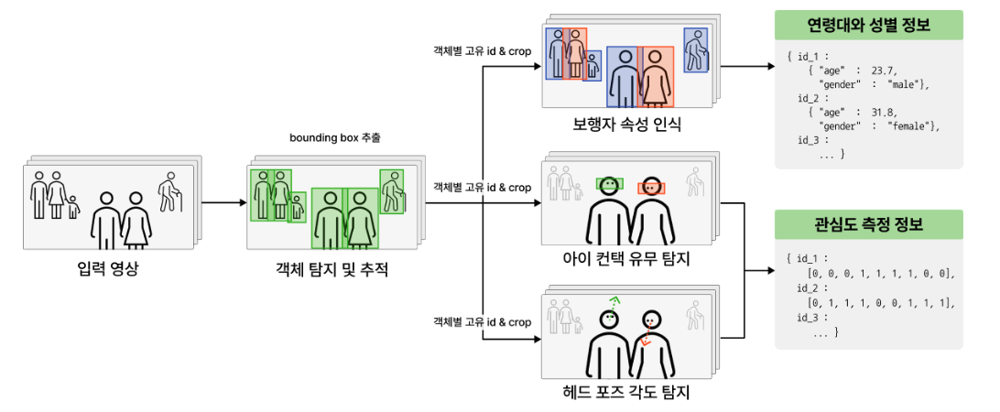
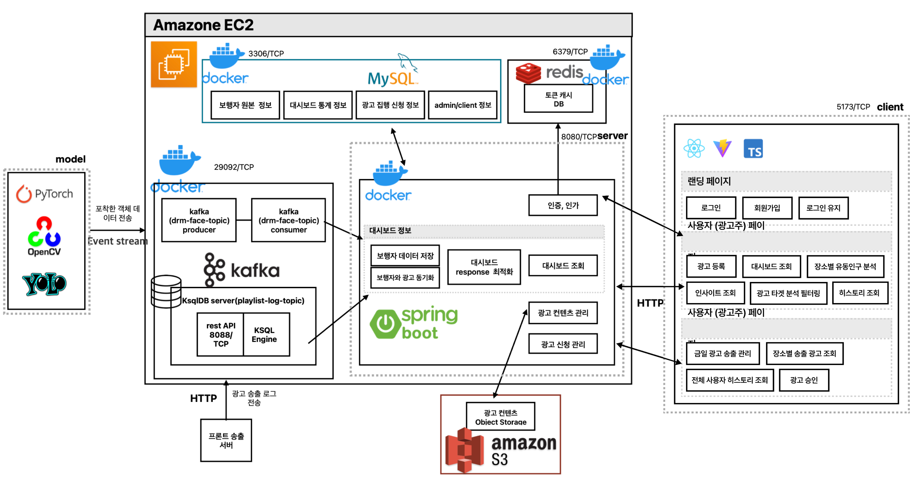

# 📚 Do you Read me? (DRM)


### 1. 프로젝트 소개

 프로젝트 "Do you Read me?"은 지하철 탑승객들이 지하철 출입문 상단의 디스플레이 광고에 얼마나 많은 관심을 가지는지 측정하고, 유동인구의 관심도를 분석하여 관심 인구에 대한 정보를 대시보드 형태로 제공하는 광고주 대상 B2B 서비스입니다. DRM은 광고주가 최적의 광고를 수립할 수 있도록 도와주며 광고 캠페인의 ROI(Return On Investment)를 향상시키는 데 기여합니다. 서울 2호선 지하철 열차 내 광고 디스플레이부터 시범 적용을 시작하여, 추후 다른 옥외광고 분석까지 가능하도록 확장할 예정입니다.

### 2. Abstract

 The project "Do you Read me?" is a B2B service designed to measure the level of interest subway passengers have in the display advertisements located above subway doors and analyze the attention of the floating population. This service provides advertisers with information about interested populations in the form of a dashboard. DRM helps advertisers optimize their ad campaigns and enhance the ROI (Return On Investment) of their advertising efforts. Initially, the service will be piloted with advertisement displays inside the trains of Seoul Metro Line 2, with plans to expand to other outdoor advertising analyses in the future.


### 3. 영상
### 3.1. 소개 영상(중간 발표)
[](https://youtu.be/Qv744Msoz18)

### 3.2 시연 영상
[](https://www.youtube.com/watch?v=15gxa_gtftI)

### 4. 모델 워크플로우


### 5. 소프트웨어 아키텍처


### 6. 팀 소개

|||||||
|---|---|---|---|---|---|
|[이동국(****2282)](https://github.com/donggook-me)|[황솔희(****3168)](https://github.com/ssoree912)|[허수빈(****1320)](https://github.com/soobinheo)|[이강희(****1653)](https://github.com/khleexv)|[최지원(****3091)](https://github.com/Choi-Jiwon-38)|[장수미(****3216)](https://github.com/jangsumi)|
|Back-End|Back-End|AI|AI|Front-End|PM, Designer|

### 7. 사용법

Common
```bash
git clone https://github.com/kookmin-sw/capstone-2024-04.git
```

<details>
<summary>Client</summary>
<div markdown="1">

    cd src/client/ 
    yarn install
    yarn run dev

</div>
</details>

<details>
<summary>Server</summary>
<div markdown="1">
    
    cd src/server/
    docker-compose up -d

</div>
</details>

<details>
<summary>Model</summary>
<div markdown="1">

    cd src/model
    pip3 install -r requirements.txt
    python3 pipeline/main.py

</div>
</details>


### 8. 관련 자료
🗂️ [중간 발표 자료](docs/%EC%A4%91%EA%B0%84%EB%B0%9C%ED%91%9C-%EC%B5%9C%EC%A0%81%ED%99%94%EB%90%9C%20%EC%98%A5%EC%99%B8%20%EA%B4%91%EA%B3%A0%EB%A5%BC%20%EC%9C%84%ED%95%9C%20%EA%B4%91%EA%B3%A0%20%ED%9A%A8%EA%B3%BC%20%EB%B6%84%EC%84%9D%20%EC%86%94%EB%A3%A8%EC%85%98-4%EC%A1%B0.pdf) <br />
🗂️ [중간 보고서](docs/%EC%A4%91%EA%B0%84%EB%B3%B4%EA%B3%A0%EC%84%9C-%EC%B5%9C%EC%A0%81%ED%99%94%EB%90%9C%20%EC%98%A5%EC%99%B8%20%EA%B4%91%EA%B3%A0%EB%A5%BC%20%EC%9C%84%ED%95%9C%20%EA%B4%91%EA%B3%A0%20%ED%9A%A8%EA%B3%BC%20%EB%B6%84%EC%84%9D%20%EC%86%94%EB%A3%A8%EC%85%98.pdf) <br />
🗂️ [포스터](docs/%ED%8F%AC%EC%8A%A4%ED%84%B0-%EC%A7%80%ED%95%98%EC%B2%A0%20%ED%83%91%EC%8A%B9%EA%B0%9D%20%ED%96%89%EB%8F%99%20%EA%B8%B0%EB%B0%98%20%EA%B4%91%EA%B3%A0%20%EA%B4%80%EC%8B%AC%EB%8F%84%20%EB%B6%84%EC%84%9D%20%EB%8C%80%EC%8B%9C%EB%B3%B4%EB%93%9C-4%EC%A1%B0.pdf) <br />
🗂️ [최종 발표 자료](docs/%EC%B5%9C%EC%A2%85%EB%B0%9C%ED%91%9C-%EC%A7%80%ED%95%98%EC%B2%A0%20%ED%83%91%EC%8A%B9%EA%B0%9D%20%ED%96%89%EB%8F%99%20%EA%B8%B0%EB%B0%98%20%EA%B4%91%EA%B3%A0%20%EA%B4%80%EC%8B%AC%EB%8F%84%20%EB%B6%84%EC%84%9D%20%EB%8C%80%EC%8B%9C%EB%B3%B4%EB%93%9C-4%EC%A1%B0.pdf) <br />
🗂️ [결과 보고서](docs/%EA%B2%B0%EA%B3%BC%EB%B3%B4%EA%B3%A0%EC%84%9C-%EC%A7%80%ED%95%98%EC%B2%A0%20%ED%83%91%EC%8A%B9%EA%B0%9D%20%ED%96%89%EB%8F%99%20%EA%B8%B0%EB%B0%98%20%EA%B4%91%EA%B3%A0%20%EA%B4%80%EC%8B%AC%EB%8F%84%20%EB%B6%84%EC%84%9D%20%EB%8C%80%EC%8B%9C%EB%B3%B4%EB%93%9C-4%EC%A1%B0.pdf) <br />
